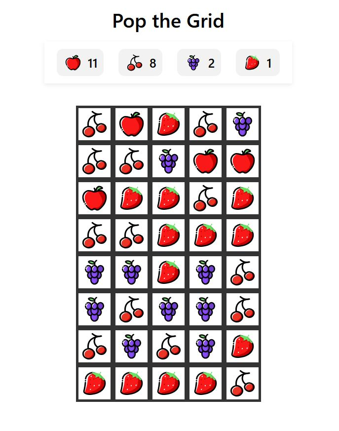

# Pop-the-Grid

**Тестове завдання**, ціль якого реалізація полягала у наступному:
1. Реалізувати прямокутне ігрове поле, що складається з комірок.
2. У кожній комірці може знаходитись один ігровий елемент. 
3. При виборі будь-якої з комірок ми маємо видаляти з поля елемент і усю повʼязану групу таких самих елементів.


## Алгоритм пошуку групи елементів

Пошук групи елментів виконувався за перебором в глибину (**DFC**), з перевіркою комірки по типу для додавання потрібних в групу видалення.


### Деталі реалізації

Основні етапи пошуку групи на видалення:
1. Користувач натискає на клітину сітки.
2. Спрацьовує подія, що передає координати натиснутої клітини в середені логічної сітки.
3. **ClusterRemover** реагує на подію і починає пошук в глибину по 4 головних напрямках (верх, низ, право, ліво).
4. Під час проходу схожі за типом елементи додаються у кластер, до поки вільних до перевірки не залишається.
5. Видалення отриманної групи.


## Результат



## Як запустити
1. Клонувати репозиторій:
   ```bash
   git clone https://github.com/BohdanHorlach/Pop-the-Grid.git 

2. Відкрити директорію з проектом та запустити його через команду npx serve:
   ```bash
   cd Pop-the-Grid
   npx serve .

   або ж, запустити напряму:
   ```bash
   npx serve Pop-the-Grid

3. Перейти за локальним посиланням:
   ```bash
   http://localhost:3000 